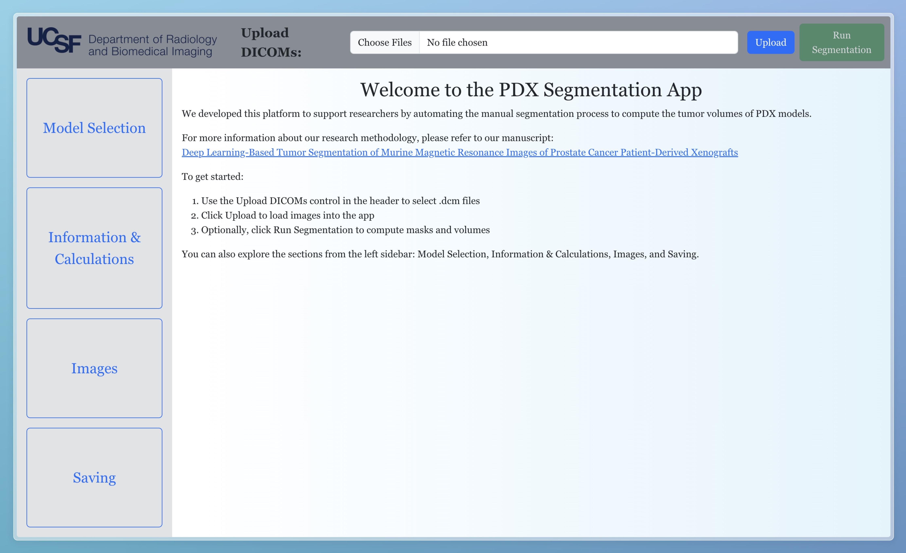

# PDX Segmentation App



End-to-end imaging app: React frontend + FastAPI backend.

## Quick start (single Docker container)

Requirements:
- Docker installed (Docker Desktop on macOS/Windows)
- Optional GPU on Linux: NVIDIA drivers + NVIDIA Container Toolkit

Run:
```bash
./run.sh                    # CPU
GPU=1 ./run.sh              # GPU (Linux + NVIDIA)
```

What it does:
- Builds the React frontend and bundles it into the backend image
- Runs the FastAPI server at `http://localhost:8000`
- Serves the SPA from `/` and the API under the same origin
  (Ephemeral storage by default; data is not persisted outside the container)

Environment variables:
- `PORT` (default 8000 inside container; host maps to 8000)
- `PLATFORM_FLAG=--platform=linux/amd64` (if building on Apple Silicon and you need x86)

Notes:
- macOS/Windows run CPU-only. GPU mode requires Linux and NVIDIA toolkit.
- The image includes TensorFlow CPU by default; adjust as needed for your platform.

## Local development (run frontend and backend separately)

Prerequisites:
- Node.js 18+ and npm
- Python 3.11

1) Backend
```bash
cd backend
python -m venv .venv
source .venv/bin/activate
pip install -r requirements.txt

# Run API
uvicorn app.main:app --host 0.0.0.0 --port 8000
```

2) Frontend (in a second terminal)
```bash
cd frontend
npm install

# Point the frontend to the backend API (optional; defaults to http://localhost:8000)
export REACT_APP_SERVER_API_URL=http://localhost:8000

npm start
```

Frontend API base:
- The frontend uses `process.env.REACT_APP_SERVER_API_URL || 'http://localhost:8000'`.
- For production builds, set `REACT_APP_SERVER_API_URL` accordingly before `npm run build`.

## Project layout

```
backend/           # FastAPI app and ML models
frontend/          # React app (Create React App)
run.sh             # Build and run single-container image
Dockerfile         # Multi-stage build (frontend + backend)
.dockerignore
```

## Health check
API health endpoint: `GET /health` → `{ "status": "ok" }`
